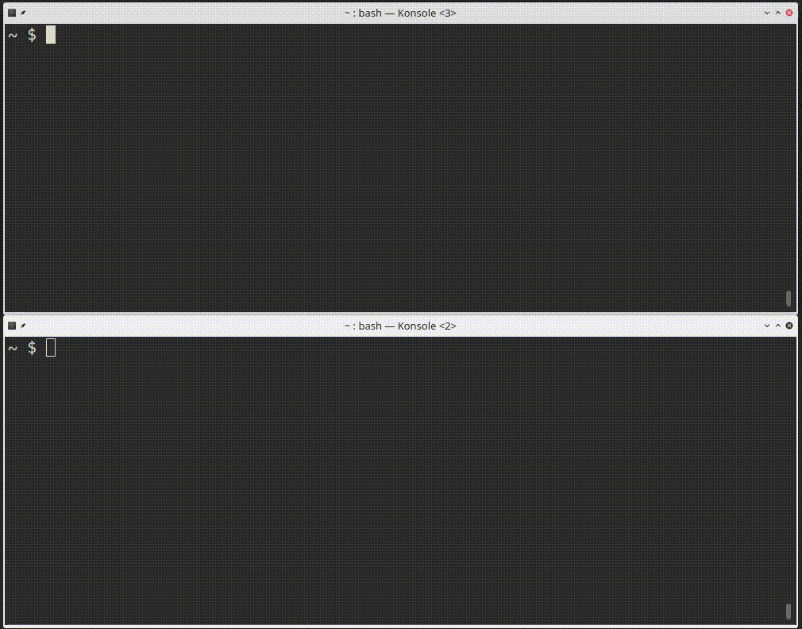

## tshat - chat server for ssh clients

*tshat* is a chat server where users authenticate and send messages using ssh clients.



## WARNING: at this point (20210624), *tshat* and the underlaying ssh library *thrussh* did not receive much eye scrutiny

The design is the opposite of usual chat systems : With tshat everything (like chat history or user settings) is stored on the server. The client does not require a specific application (only ssh client), and the protocol is standard SSH.

*tshat* main features:
* server side chat, dumb client
* user accounts are defined at server startup time, different from system users
* tshat does not require any privileges, only a TCP port must be reachable
* user authentication by password (argon2) or ssh key (ed25519/rsa)
* chat log and user settings can be logged to file and remembered accross server restarts by using _-l <logfile>_

Example command to run the server with one 'laurent' user using password, and allowing any other user to log-in with whatever password:
```
$ tshat laurent:'$argon2id$v=19$m=65536,t=3,p=1$aTNjaXV2SkJyV1haQ0FRYzA5ZDZGTlJ6$xy2aM12e1f8V5iFCJuW/FFHPhEW/DZbWrK+GFsPEnDk' *:*
```

Users definition can also be passed line by line through stdin by using '-'.
```
$ cat | tshat - <<-_EOF
laurent:'$argon2id$v=19$m=65536,t=3,p=1$aTNjaXV2SkJyV1haQ0FRYzA5ZDZGTlJ6$xy2aM12e1f8V5iFCJuW/FFHPhEW/DZbWrK+GFsPEnDk'
*:*
_EOF
```

# Tshat command-line usage

``` bash
$ tshat -h
tshat 0.1
chat server for ssh clients

USAGE:
    tshat [FLAGS] [OPTIONS] <users>...

ARGS:
    <users>...    - | <username>:'<password-hash>'|<ssh-pubkey>

FLAGS:
    -d               do not daemonize and log to stdout (twice enables dependencies debugging)
    -h, --help       Prints help information
    -K               generate new server key and do not write key/fingerprint to file
    -V, --version    Prints version information

OPTIONS:
    -k <keyfile>        server key file, defaults to .tshat_key and .tshat_key.fp for fingerprint
    -l <logfile>        chat log file, default to no logging
    -p <port>           server port to bind, defaults to 2222
```

# User commands in-chat

* uppon user connection the chat history since last user connection is printed ("unseen messages")
* new messages trigger a bell at connected clients, _/nobell_ will disable this
* user settings are remembered accross connections

Additional to writing text to the chat, ssh clients can send commands:
* _/history_ print chat history
* _/bell_ enable message bell notification (default)
* _/nobell_ disable message bell notification
* _/conf_ show user configuration
* _/users_ list allowed users and active connections
* _/quit_ exit chat
* _/help_ prints the list of commands

# Keyboard shortcuts

* _ctrl-c_ clear prompt
* _crtr-d_ exit (if prompt is clear)

# History log

*tshat* keeps the history of the discussion in memory.

If -l <chatlog> is specified, the log will be written to a file and loaded uppon startup.

The log is also used by the server to print history to clients and remember user settings.

# Users authentication

The definition of a user is as follows:

```
<username>:'<password-hash>'|<ssh-pubkey>
```

```
<username>
    name of the user
    a user can connect multiple times simultenaously using the same username.
    this will be indicated in the chat by <username>:2 for the second connection.

<password-hash>
    argon2id password hash
    should be escaped with single quotes (') as it contains dollars ($) that can conflict with your shell.
    example: '$argon2id$v=19$m=2097152,t=3,p=1$YmxhYmFsYmxh$XwxqV3larNmnGMjG9rnTo0GcabudWqdjQt9mxszNqfQ'
    can be generated by (uses 2GB of memory, first recommended per draft-irtf-cfrg-argon2-13):
    $ cat | tr -d '\n' | argon2 $(openssl rand -base64 18) -id -m 21 -t 1 -e
    <enter-your-password>
    <press-ctrl-d>
    can be generated by (uses 64MB of memory, second recommanded per draft-irtf-cfrg-argon2-13):
    $ cat | tr -d '\n' | argon2 $(openssl rand -base64 18) -id -m 16 -t 3 -e
    <enter-your-password>
    <press-ctrl-d>

<ssh-pubkey>
    public key of the user (ed25519 or RSA)
    example: AAAAC3NzaC1lZDI1NTE5AAAAIFkUjw85+32nFH+u0AmqyFiw9mzA1O9Qkwb94NrCW/Bb
    can be generated by:
    $ ssh-keygen -f /tmp/mysshkey -t ed25519
```

IP address of the connecting users are logged and printed in the chat.

# Build and install

The usual rust and cargo way.

Build:
``` bash
cargo build --release
```

Run:
``` bash
./target/release/tshat
```

Install:
``` bash
cargo install --path .
```

# Compatibility and limitations

*tshat* server has been tested on Linux.

SSH clients that do not support chacha20-poly1305@openssh.com cipher cannot connect, as it is the only cipher implemented by tshat underlaying ssh library _thrussh_. It is the case of JuiceSSH for example.

# Similar projects

* ssh-chat https://github.com/shazow/ssh-chat

ssh-chat is an ssh server that implements a server-based chat system, like tshat. It has lots of feature that i did not consider as essential (private messages, colors, chat kick, /away, ...), the authentication system seemed too complicated and it does not implement proper history. ssh-chat is written in go.

# External documentation

## SSH protocol

* https://datatracker.ietf.org/doc/html/rfc4250
RFC 4250, The Secure Shell (SSH) Protocol Assigned Numbers, 2006

* https://datatracker.ietf.org/doc/html/rfc4251
RFC4251 The Secure Shell (SSH) Protocol Architecture, 2006

* https://datatracker.ietf.org/doc/html/rfc4252
RFC 4252, The Secure Shell (SSH) Authentication Protocol, 2006

* https://datatracker.ietf.org/doc/html/rfc4253
RFC 4253, The Secure Shell (SSH) Transport Layer Protocol, 2006

* https://datatracker.ietf.org/doc/html/rfc4254
RFC 4254, The Secure Shell (SSH) Connection Protocol, 2006

* https://api.libssh.org/stable/#main-rfc
index of IETF SSH related standards

* https://www.iana.org/assignments/ssh-parameters/ssh-parameters.xhtml
SSH parameter constants

* https://www.linuxjournal.com/article/9566
The OpenSSH Protocol under the Hood, by Girish Venkatachalam on April 1, 2007
	* https://www.linuxjournal.com/files/linuxjournal.com/linuxjournal/articles/095/9566/9566f2.jpg
OpenSSH protocol flow

* https://wh0.github.io/2018/02/27/ssh-protocol.html
SSH architecture schematic

* https://upload.wikimedia.org/wikipedia/commons/f/fc/SSH-sequence-password.svg
Sequence Diagram for SSH Password Authentication

## thrussh library (used in tshat)

* Thrussh in Rust
A full implementation of the SSH 2 protocol, both server-side and client-side.
Thrussh is completely asynchronous, and can be combined with other protocols using Tokio.
https://docs.rs/thrussh/0.32.9/thrussh/
https://nest.pijul.com/pijul/thrussh
example uses
	https://www.mknowles.com.au/entry/async_ssh_commands_in_rust_nightly/
	https://github.com/startere/thrussh-example

## Other SSH libraries

* C: libssh
https://www.libssh.org/
https://git.libssh.org/projects/libssh.git/

* rust: redox-ssh
kind-of ancester of thrussh ?
https://gitlab.redox-os.org/redox-os/redox-ssh

# TODO

first
* plan fix various XXX in the code

then
* feature: user command to hide connect/disconnect, and server default flag
* feature: user command to hide timestamp, and server default flag
* bugfix: patch thrussh to handle TCP client connection timeout
* bugfix: user lastseen update on receiving keep-alive (need patch thrussh to handle keepalives correctly)
* bugfix: ignore escape characters, using https://github.com/alacritty/vte for parsing recv_buf
* feature: user with admin role who can wipe the history using /wipe
* feature: source IP filtering

later
* encrypted log file ?
* file drop via sftp
* mosh support by integrating mosh C++ code and some rust bindings
